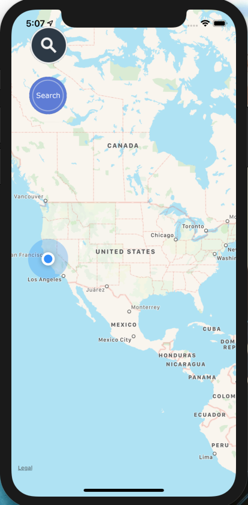
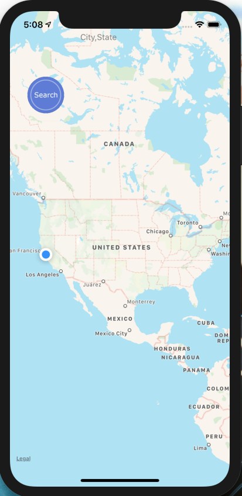
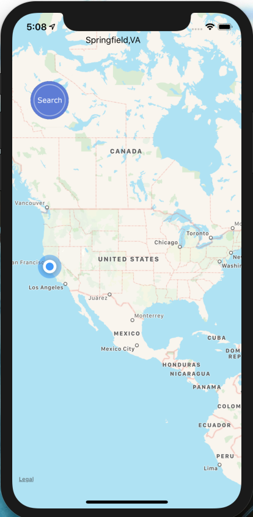
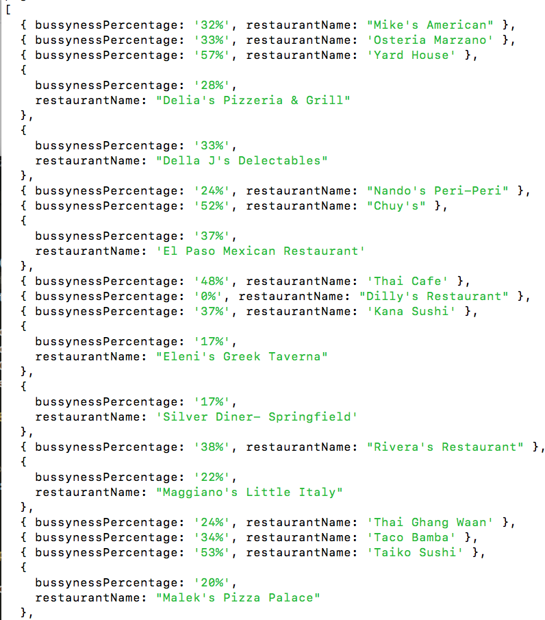
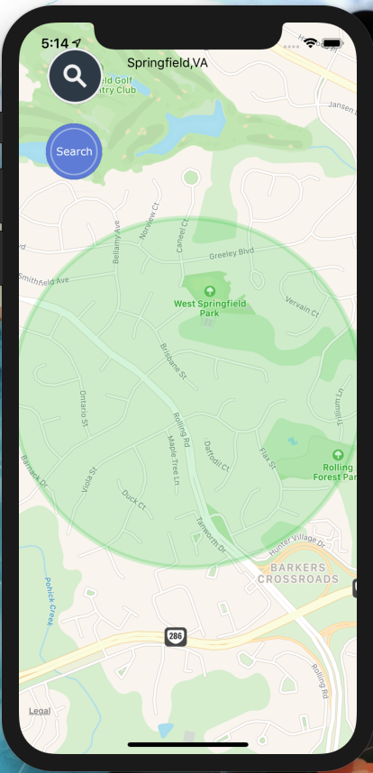
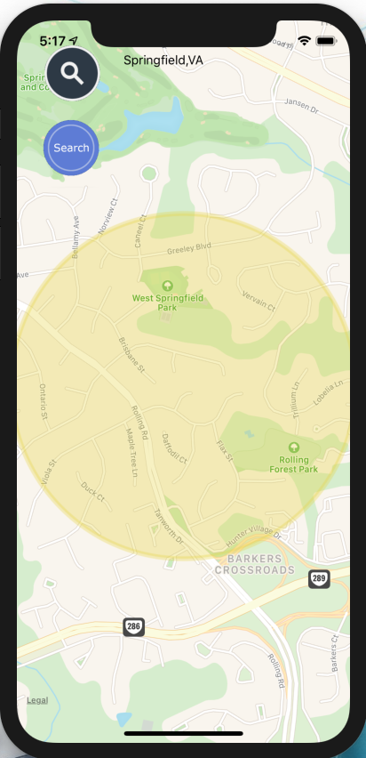
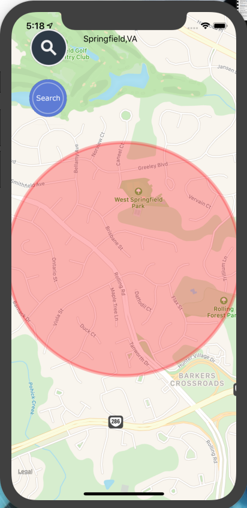

# UberEats_HotZones
UberEats city hotzones(React native)

Using Puppeteer.js to scrape data from google maps and Express.js to collect and fetch data. The application displays information to a user about how busy the restaurants are around a specific US location.

the app will start with a map showing the user's current location, a search input fill, and a search button.

 
tapping on the search icon will reveal the input field.

 

then hit search and wait. Meanwhile, the backend is collecting the information requested base on the location inserted.

after the server finished collecting the information the app will display the location with a color area representing the busyness percentage.

  

